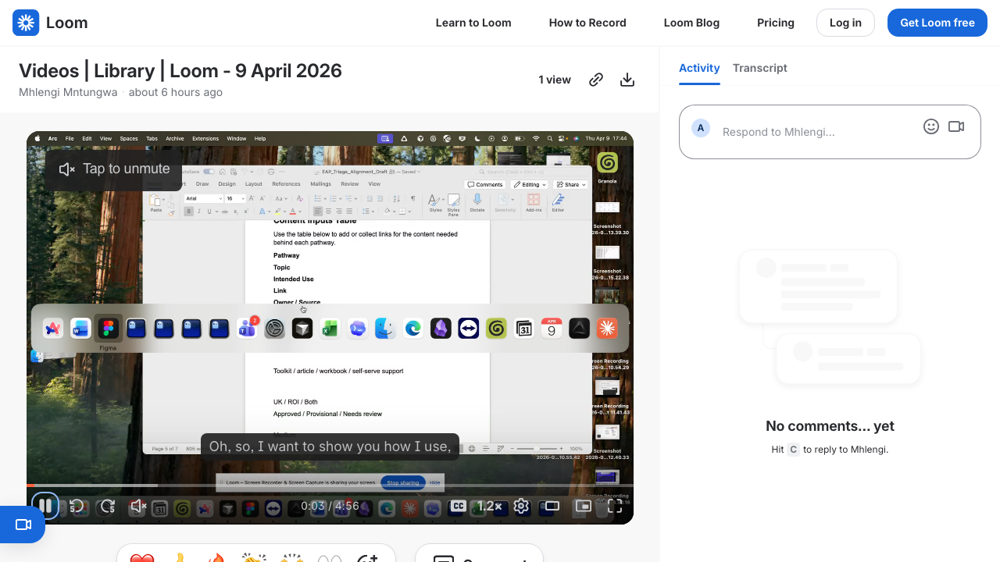

# /mothership_terminal -- Use Case Demo

## What the demo shows

A live modal bug fix dispatched through Mothership while a second task runs in parallel.

The setup: one main terminal acts as the dispatch window. From here you can see all active tasks, check on their progress, and course-correct without touching the child terminals. All the child terminals were originally spawned from this same window.

**The bug:** A "who liked" screen has a backdrop that covers the container but not the web frame behind it -- so it looks like a modal but isn't quite right.

**The workflow in the demo:**

1. Spot the bug visually in the browser
2. Use **Agentation** (a browser plugin rooted at `app.tsx`) to click the element and annotate it -- press C to copy the DOM context
3. Use **Super Whisper** to dictate the task description: describe the bug in plain speech, mention the screen, what's wrong, and ask it to check `/spidey` for correct modal backdrop patterns
4. Paste the speech-to-text output + the copied DOM into the mothership prompt
5. Mothership spawns a new terminal window that picks up the task and runs it independently
6. Meanwhile the original mothership session keeps going -- another task is already running in the background

At no point do you switch context. You speak the problem, annotate the element, paste, dispatch. The mothership window stays open as the control plane.

## Tools shown

- `/mothership_terminal` -- central dispatch, spawns and monitors child terminals
- **Agentation** -- browser plugin for annotating UI elements and copying DOM context
- **Super Whisper** -- speech-to-text for dictating task prompts (preferred over Whisper Flow for usage limits)
- `/spidey` -- cross-references memory files and past task summaries to surface correct patterns before the model guesses

## Coming up in the demo

Hooks are mentioned at ~4:00 as the next thing to build -- programmatic prompt injections as an alternative to relying on the model to self-trigger behaviours.
